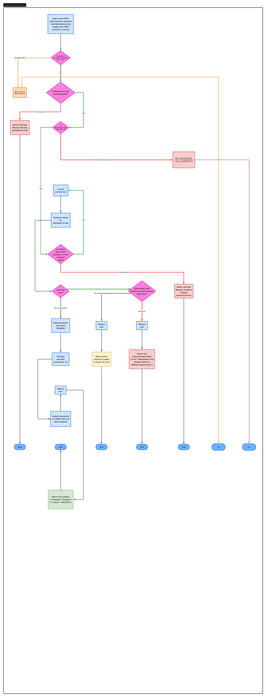

# Idempotency Gateway

A RESTful payment processing API that guarantees every payment is executed **exactly once**, regardless of how many times the request is retried.

---

## Architecture Diagram



---

## Setup Instructions

**Requirements:** Python 3.11+

```bash
# 1. Clone the repository and navigate to the project
cd backend/Idempotency-gateway

# 2. Create and activate a virtual environment
python -m venv .venv
source .venv/bin/activate        # Windows: .venv\Scripts\activate

# 3. Install dependencies
pip install -r requirements.txt

# 4. Apply migrations
python manage.py migrate

# 5. Start the server
python manage.py runserver
```

The API will be available at `http://127.0.0.1:8000`.

---

## API Documentation

### `POST /api/v1/process-payment`

Processes a payment. Guaranteed idempotent via the `Idempotency-Key` header.

**Headers**

| Header            | Required | Description                          |
|-------------------|----------|--------------------------------------|
| `Idempotency-Key` | Yes      | A unique UUID v4 string per request  |
| `Content-Type`    | Yes      | `application/json`                   |

**Request Body**

```json
{
  "amount": 100,
  "currency": "GHS"
}
```

---

### Scenario 1 — First Request (Happy Path)

```bash
curl -X POST http://127.0.0.1:8000/api/v1/process-payment \
  -H "Content-Type: application/json" \
  -H "Idempotency-Key: 550e8400-e29b-41d4-a716-446655440000" \
  -d '{"amount": 100, "currency": "GHS"}'
```

**Response — `201 Created`**
```json
{
  "message": "Charged 100 GHS",
  "transaction_id": "550e8400-e29b-41d4-a716-446655440000",
  "status": "SUCCESS",
  "status_code": 201
}
```

---

### Scenario 2 — Duplicate Request (Same Key + Same Body)

Send the exact same request again.

**Response — `201 Created`** *(no processing, instant response)*
```json
{
  "message": "Charged 100 GHS",
  "transaction_id": "550e8400-e29b-41d4-a716-446655440000",
  "status": "SUCCESS",
  "status_code": 201
}
```

Response header included:
```
X-Cache-Hit: true
```

---

### Scenario 3 — Conflict (Same Key, Different Body)

```bash
curl -X POST http://127.0.0.1:8000/api/v1/process-payment \
  -H "Content-Type: application/json" \
  -H "Idempotency-Key: 550e8400-e29b-41d4-a716-446655440000" \
  -d '{"amount": 500, "currency": "GHS"}'
```

**Response — `422 Unprocessable Entity`**
```json
{
  "error": "Idempotency key already used for a different request body."
}
```

---

### Error Responses

| Scenario                          | Status | Message                                        |
|-----------------------------------|--------|------------------------------------------------|
| Missing `Idempotency-Key` header  | `400`  | `Idempotency-Key header is required.`          |
| Key is not a valid UUID v4        | `400`  | `Idempotency-Key must be a valid UUID v4.`     |
| Invalid request body              | `400`  | Field-level validation errors                  |
| Key reused with different body    | `422`  | `Idempotency key already used for a different request body.` |
| Too many requests                 | `429`  | `Request was throttled.`                       |

---

## Design Decisions

### SHA-256 Request Hashing
Rather than storing and comparing the full request body, each payload is hashed with SHA-256 (keys sorted, whitespace normalized) before being saved. This makes conflict detection fast and storage-efficient regardless of payload size.

### Per-Key Threading Locks (Race Condition Handling)
An in-memory dictionary maps each `Idempotency-Key` to a `threading.Lock`. When a request arrives, it acquires that key's lock before touching the database. If two identical requests arrive simultaneously, the second one blocks until the first finishes processing and commits its result, then reads the cached response instead of spawning a duplicate payment. This satisfies the bonus in-flight requirement without polling or retrying.

### PENDING / COMPLETED Status
Transactions are written to the database immediately with `PENDING` status before the 2-second processing delay. This is to create a clear audit trail and makes it easy to detect and alert on stuck transactions in a production environment.

### SQLite
Used for simplicity and zero-configuration setup. The schema and queries are standard Django ORM, so swapping to PostgreSQL for production requires only a settings change.

---

## Developer's Choice Features

### 1. UUID v4 Key Enforcement
The `Idempotency-Key` header is validated to be a well-formed UUID v4 before any database operation. Short or predictable keys (e.g. `"1"`, `"payment"`) create a real collision risk  two clients could independently choose the same key, causing one to incorrectly receive the other's cached response. Enforcing UUID v4 makes key uniqueness statistically guaranteed.

### 2. Rate Limiting
Requests are throttled to **10 per minute per IP address** using DRF's built-in `AnonRateThrottle`. This protects the service from brute-force key enumeration and accidental retry storms from misconfigured clients.